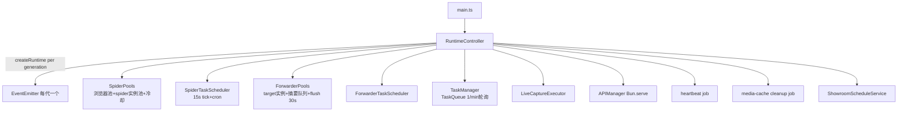
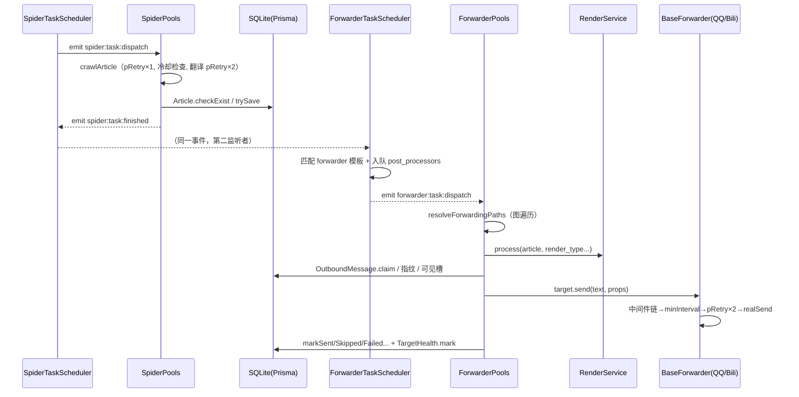
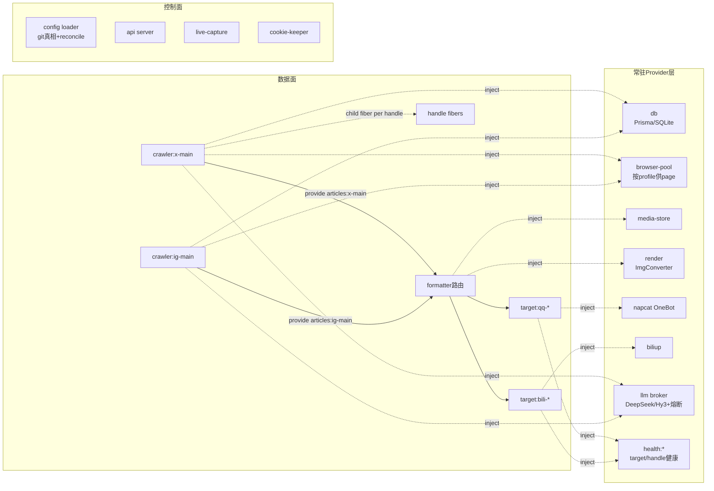

# idol-bbq Cordis 化可行性评估报告

- **日期**：2026-08-16
- **对象**：`idol-bbq-utils`（本地工作树 `/Users/zou/ytdlp/subPrep/livestr/idol-bbq-utils`，维护完成后状态；HEAD `f3abbf5`）
- **方式**：全程只读；本人逐行精读核心装配层（`main.ts`、`runtime-controller.ts`、`managers/spider-manager.ts`、`managers/forwarder-manager.ts` 关键段），四个并行子代理全量覆盖 middleware、`core/*`、services、API/DB/start.sh
- **约束**： idol-bbq 本体不写入；重构走新项目（`cordis-forwarder/`）；内部开发、不对外开放插件；目标仅为敏捷/可维护/弹性
- **配套交付**：`testset/PITFALLS.md`（40 条坑登记）、`testset/cases/`（82 条测试用例）、`testset/fixtures/`

---

## 1. 结论摘要

**可以 Cordis 化，建议以新项目形式推进。** 依据不是"理论上可行"，而是现状代码已经手写了一半的 Cordis 且写劣化了：

1. 已有生命周期契约 `BaseCompatibleModel.init/stop/drop`（`app/tweet-forwarder/src/utils/base.ts:18`），但覆盖不均、泄漏点明确；
2. 已有运行时重组装机制（`RuntimeController.reload`），但粒度是**全拆全建**（`runtime-controller.ts:226-272`），一次配置变更重启全部浏览器会话；
3. 已有隐式组件图（connections 五张 map + pipelines 编译层 + route-graph 诊断），但同一张图在 4 个文件里各自遍历；
4. 状态分层天然干净（DB 持久态 / generation 内存态 / 模块全局态 / 磁盘态），恰好是 Cordis 边界划分所需要的分层；
5. 领域代码（`core/spider`、`core/render`）是无生命周期纯库，90% 可平移。

新项目 = Cordis host + 显式组件图 + 原库保留。domain 逻辑重写得极少，工作集中在"布线图重画"。

---

## 2. 背景

### 2.1 范式依据

Cordis 论文（cordiverse/paper《A Programming Paradigm for Spatiotemporal Composability》）给出两个运行时维度：

- **时间可组合性**：每个 effect 配对显式逆（`Γ → Γ×(Γ→Γ)`），运行时跟踪，卸载时按累加器回滚；
- **空间可组合性**：组件声明 coeffect（inject/provide），上下文变化按满足谓词分类为 activating/deactivating/neutral，驱动生命周期。

本评估前两轮已确认：论文的三个"近致命"问题（承重假设不可验证、恢复期失败未建模、无墙钟活性）在**内部开发**场景全部有工程对策（原语库+PBT、dispose 容错、超时强卸），不构成本项目障碍。

### 2.2 idol-bbq 是什么

SNS 抓取转发系统：X / Instagram / TikTok / YouTube / 官网(22/7 FC) → 处理器（LLM 翻译/抽取）→ 格式化渲染（文字卡/图片卡）→ 目标（QQ 群经 NapCat OneBot、B 站动态/投稿）。TypeScript 单进程（Bun），lerna monorepo：

| 包 | 角色 | 生命周期 |
|---|---|---|
| `core/spider` | 纯爬取引擎库（9 个 spider 插件） | 无（纯函数式，资源由调用方持有） |
| `core/render` | satori/resvg 卡片渲染 + 文本渲染 | 无 |
| `core/log` / `core/utils` | winston / pRetry 等 | — |
| `app/tweet-forwarder` | 主应用：managers(4) + middleware(processor/forwarder/media) + services(71) + db + API | `BaseCompatibleModel` 部分覆盖 |

---

## 3. 现状架构详析

### 3.1 组成根与 generation 模型

关键事实（证据 → 发现）：

| 证据 | 发现 |
|---|---|
| `runtime-controller.ts:226-272` `performReload` | reload=先 `stopRuntime` 全拆再 `createRuntime` 全建，失败回滚也是全量；`generation` 只是计数器 |
| `runtime-controller.ts:419-451` `stopRuntime` | 停调度→停模型（逆序）→等 30s idle→强制 teardown→drop。无逐组件概念 |
| `SpiderPools.stop/drop` 调 `browserPool.closeAll()`（spider-manager.ts:1760/1770） | **任何配置变更都杀掉全部 Chrome 会话**——对爬虫账号是最高的操作风险暴露 |
| `forwarder-manager.ts:1003-1046` | target 在 pool init 时逐个 new + init；id 无显式时 `md5(JSON.stringify(cfg))` |
| `runtime-controller.ts:306-317` | api-only 模式只建路由图不起调度——说明路由图与执行体已可分离，是好事 |

### 3.2 数据面：一篇文章的完整旅程

要点：

- **事件桥只有两个事件对**（`spider:task:*`、`forwarder:task:*`），其余协作全部走 DB 表（task_queue/service_state）或直接函数调用；
- **formatter 无运行时对象**——它是纯配置，由 `RenderService.process` 按 `render_type` 执行（render-service.ts:232 起）；
- **连接图被 4 处各自遍历**：forwarder-manager.ts:1962、spider-manager.ts:632/658、route-graph-service.ts:198、quick-config-service.ts:315，且都是 id|name 双键探测。

### 3.3 控制面

- `APIManager`（3217 行）：全部读写端点；`saveConfigAndReload`（api-manager.ts:1268-1349）有进程内串行链、原子 rename、外部编辑拒写、字节校验回滚——质量不差；
- `quick-config-service.ts:659-720` `compileConnectionsFromQuickPatch`：partial-ownership 语义（patch 提及的 crawler 拥有其边）——比 8/15 审计时的"全清"描述已改善，但语义复杂、与 pipelines 编译（只取每 pipeline 第一个 processor，:631-634）耦合，仍是事故面；
- `pipelines[]` 是 canonical 形式，parse 期 `normalizePipelinesForRuntime` 擦除 legacy connections（quick-config-service.ts:722-734）。

### 3.4 状态分层（重构最重要的现状事实）

| 层 | 内容 | Cordis 归属 |
|---|---|---|
| DB 持久态 | 5 平台 article 表、outbound_messages、forward_by、media_hashes、content 指纹、aggregation_windows/items、video_pairings、target_health、task_queue、service_state | 常驻 provider 的领域状态（emission 侧，绝不回滚） |
| generation 内存态 | 冷却/升级表、tag digest、pendingMediaBatches、摘要内存索引、RenderService 缓存、processor 实例缓存 | fiber 私有态；冷却类应上移到常驻 provider |
| 模块全局态 | `biliUploadQueues`、hy3 breaker map、Prisma client、X list cursor、IG profile cache、TT resolve cache | **跨代污染区**，必须收编为 provider fiber |
| 磁盘态 | media store（内容寻址）、browser userDataDir、cookie 文件、breaker json、heartbeat json | provider 持有 + effect 跟踪 |

### 3.5 生命周期覆盖缺口（Evidence → Finding）

| 证据 | 缺口 |
|---|---|
| `middleware/processor/base.ts:61` drop 是 noop；`google.ts:56-67` 持久 ChatSession | processor 从不真正释放 |
| `spider-manager.ts:1765-1773` drop 只清 map | spider/processor 实例无 drop 调用 |
| `core/spider/utils/index.ts:197-206` SimpleExpiringCache 每条目一个 setTimeout | 定时器无集中回收 |
| `render-service.ts:147-1611` 无 init/stop/drop | 渲染服务游离在生命周期外 |
| `bilibili.ts:55` 模块级上传队列 | 跨 generation 存活 |
| `db/client.ts:10` Prisma 从不 $disconnect | 关闭语义缺失 |
| `forwarder-manager.ts:1461-1491` drop 清了多数 map 但漏 articleTargetCooldowns/summaryCardTargetCooldowns | teardown 不完整的确证 |

**发现**：这不是"代码质量差"，而是没有结构强迫——每个资源靠作者记得配对。这正是论文 §7.3 批判的"developer-authored recovery"形态，也是 Cordis 化收益最大的落点。

---

## 4. Cordis 化目标架构

### 4.1 组件图

### 4.2 coeffect 词汇表（新项目的设计起点）

| key | 提供方 | 消费方 | 说明 |
|---|---|---|---|
| `db` | db provider | 全体 | Prisma 单例收编 |
| `browser.page:<profile>` | browser-pool | crawler | 按 profile 隔离（realm 可用） |
| `articles:<crawler>` | crawler fiber | formatter 路由 | 文章流 |
| `llm:<id>` | llm broker | crawler/摘要/processor-run | 多实现 broker，熔断为 provider 健康态 |
| `render` / `media-store` | 常驻 | formatter/send 路径 | |
| `napcat` / `biliup` | 常驻 | target | 发送通道 |
| `health:target:<id>` | target-health | target fiber | 禁言→deactivate→解禁恢复 |
| `health:handle:<platform>:<id>` | crawler-health | handle child fiber | 私密/无效→熔断 24h |

### 4.3 边界纪律（做错会出生产事故的一条）

- **可回滚 effect**：定时器/cron/interval、emitter 监听、browser session/page、WebSocket、子进程（yt-dlp/gallery-dl/ffmpeg/curl）、cookie seed 状态、API 路由、调度注册；
- **emission 绝不回滚**：入库文章、已发消息、media store 文件、已完成 task、已花 LLM 费用。文章库是 append-only 领域状态，逆 = no-op；
- **中间态上移**：冷却/健康/熔断从 generation 内存迁到常驻 provider——即论文 §7.3"放进更长寿命的依赖"，顺带修复"reload 后冷却失忆导致重复猛抓"；
- **顺序敏感区留组件内**：per-target minInterval、B 站上传串行队列、video pairing 窗口、摘要窗——单 fiber 内 LIFO，不追求跨组件独立性。

### 4.4 不重写的部分

`core/spider`（仅需三处小手术：`crawl()` 的 `this.log` 实例变异改 per-invocation context；X/IG 模块级 cache 挪进 provider；page 监听三种挂载机制统一为 effect 注册）、`core/render`、`core/utils/log`、Prisma schema 与 DB（连续性依赖）。**上游最活跃的 parser 文件一行不碰，merge 友好。**

---

## 5. 潜在坑（全表 40 条）

详见 `testset/PITFALLS.md`（每条含锚点/对策/测试引用）。分级摘要：

### 5.1 A 类：键控状态连续性（失效=重复发送/上传，最高危）

1. target 隐式 id 的 md5 字段序敏感（forwarder-manager.ts:1033）→ 强制显式 id + 迁移映射；
2. routeKey/outbound key/payload_hash 字节级钉住（outbound-message-service.ts:156-228）；
3. content fingerprint / media visibility slot 的 claim 必须全路径 release（含 teardown）；
4. processor 缓存键 stable stringify。

### 5.2 B 类：隐式时序

5. `spider:task:finished` 双监听者注册顺序即语义；`immediate_notify` 有意 no-op；
6. generation 销毁不取消 in-flight promise → ghost write；新 runtime 用代际令牌 + teardown 等在途。

### 5.3 C/D 类：调度与风控参数（改错=账号风险）

7. jitter 稳定哈希、minGap 60s、soft-start 15min/2min、tick 15s、防重入；
8. 冷却全表（auth30m/rate20m/private·invalid24h、IG override）、升级 ×2^n≤×8 cap6h、Retry-After、负缓存族 TTL——全部逐值钉测试。

### 5.4 E/F 类：去重与聚合（最易回归）

9. ForwardBy 的翻译直通例外、outbound CAS/stale 30min/重试 60s·2^n≤3600×5、跨键可见完成去重、媒体三级跨平台去重、>2h 跳过、errorCounter≥3；
10. 摘要队列 DB 持久 + **drop 故意保留未发**（forwarder-manager.ts:1464）、failureGeneration 键轮换 cap3、tag digest 内存态的存废需显式决策；
11. 非 live 模式 dedup/媒体批次关闭——影子对比的发散白名单来源。

### 5.5 G–I 类：渲染/LLM/浏览器

12. drop-failed 先于 hydrate（审计 §9.1 修复钉住）；render_type 全矩阵；RenderService 实例策略统一的行为差异记录；
13. Google ChatSession 持久语义需显式决策；Hy3 breaker 参数迁移；翻译失败不落库；
14. page 级监听器（`__websiteResourceGuard`、X capture buffer）随 page effect 回收；cookie seed 重建重种；移动端强制 host；cookie 按域过滤。

### 5.6 J 类：Cordis 新系统自身

15. infra provider 重载=全局级联 → 无配置化或 broker 吸收；
16. 卸载等待上限（超时强卸+污点）与 dispose 逐逆容错——论文缺口②③的工程落点；
17. 健康 coeffect 单向性（防环）；fiber-per-handle 的定时器统一回收；
18. 影子运行独立 DB；pipelines 单 processor 编译的差异决策；Bun 下 cordis loader/HMR 待验证；
19. TargetHealth.deleteUnknown 改名即丢历史——新系统改名走迁移。

---

## 6. 测试集

`testset/` 下 82 条用例，两层：

| 层 | 文件 | 条数 | 性质 |
|---|---|---|---|
| parity 钉住 | 10-config-route / 20-render / 30-send-pipeline / 40-outbound-dedup / 50-aggregation / 60-schedule-health / 70-browser-cookie / 80-processor | 71 | 每条锚定旧代码 file:line，上游变动按锚点重新推导 |
| cordis 符合性 | 90-lifecycle / 95-failure-cascade / 99-shadow-e2e | 21 | 钉新 runtime 保证：fiber 级重载、资源探针归零、逆容错、guard 超时、汇合性抽测、故障级联、影子对比、切流验收 |

harness 约定：全 fake clock；发送走 capture 模式 JSONL 对比；平台 payload 录制；`RENDER_REMOTE_ASSETS=0` hermetic 渲染；影子独立 DB + CACHE_DIR。执行序建议：**OB（去重）→ LC（生命周期）→ HC/SC（风控调度）→ 其余，SH 贯穿**。

---

## 7. 迁移计划

每阶段都有可回退点；阶段 1 的影子用独立 DB + capture 模式（SH-01/02）。切流顺序建议：IG→群2 → X→群2 → 官网 → TikTok/YouTube → 群1/群5 → PKU → B 站（投稿链路最复杂，放最后）。

## 8. 工作量与风险

| 项 | 估计 | 说明 |
|---|---|---|
| infra provider 包壳 | 3-4 天 | db/browser-pool/media/render/napcat/biliup |
| crawler/target 组件壳 | 5-8 天 | 含 per-handle fiber 与健康 coeffect |
| config loader | 3-4 天 | entry 模型 + reconcile + git 真相 |
| 控制面迁移 | 3-4 天 | API/任务队列/捕获/cookie |
| 测试 harness + parity 用例可执行化 | 4-6 天 | fake clock/capture/平台 fake |
| 影子运行 + 逐路由切流 | 2 周（并行期） | 不改代码，纯运营 |
| **合计** | **约 4-6 周（1 人）** | 生产不停 |

三大残余风险：行为奇偶（对策=影子对比+白名单）、Bun 下 cordis loader 兼容（对策=验证不过弃 HMR）、纪律腐化（对策=lint+review+资源探针 CI）。

## 9. 未决问题（需决策）

1. **Google translator 的持久 ChatSession**：重写大概率 stateless，翻译风格会漂移——接受与否？（PR-01）
2. **tag digest 内存态**：现状 reload 即失忆；新系统保留（进 provider）还是接受失忆？（AG-06）
3. **多 processor 链**：现状 pipelines 编译只取第一个；新系统支持链式还是保持单跳？（RG-02）
4. **HMR**：Bun 兼容性验证后再决定是否投入；不关键，可弃。

## 10. 附录：证据索引

核心锚点（全部经本人或子代理直接读码确认）：

- 装配/生命周期：`runtime-controller.ts:65-468`、`utils/base.ts:6-116`、`main.ts:4-22`
- 调度/冷却：`spider-manager.ts:78-100, 325-416, 450-1108, 1109-1800`、`crawler-schedule-service.ts:6-466`、`runtime-heartbeat-service.ts:39-115`
- 发送面：`forwarder-manager.ts:505-3138（含 1962-2125 路由解析、4011-4228 可见槽、4838-5616 摘要）`、`middleware/forwarder/base.ts:151-743`、`qq.ts:53-185`、`bilibili.ts:55-983`
- 出站/去重：`db/index.ts:491-2191`、`outbound-message-service.ts:11-263`、`media-cache-service.ts:491-1196`
- 配置：`config.ts:9-62`、`quick-config-service.ts:57-782`、`route-graph-service.ts:53-318`、`api-manager.ts:575-1349`
- spider 内核：`core/spider/src/spiders/base.ts:15-199`、各平台 spider、`utils/http.ts:11-122`、`browser-session-pool.ts:25-296`
- 渲染：`render-service.ts:147-1611`、`core/render/src/img/index.ts:418-524`
- 运维：`start.sh`（444 行：Bun quick_check、migration flock、备份恢复）、`Dockerfile:20-112`
