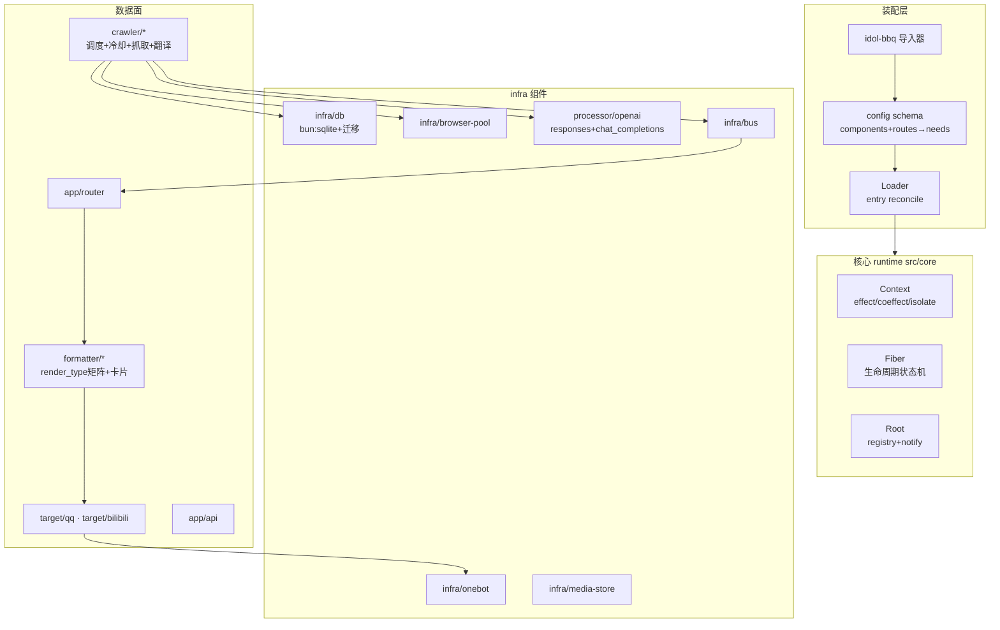

# kyestu v1 落地总览报告

- **日期**：2026-08-16
- **项目**：`kyestu/`（本地 git 仓，五个 commit）
- **性质**：idol-bbq 的 Cordis 化重构继任项目——以时空可组合性 runtime 为底座，复刻 SNS 抓取转发系统
- **验证**：248 测试全绿 + tsc clean + 生产配置启动冒烟通过

---

## 1. 一句话结论

kyestu 已达到"初始化即可上线"状态：`bun install` → 导入 idol-bbq 生产配置 → `bun src/main.ts`，全部 36 个 entry 以正确依赖顺序激活，文章全链路（抓取→翻译→入库去重→路由→渲染→发送）在测试中实证。

## 2. 架构总览



### 2.1 核心 runtime（src/core，~430 行，零依赖）

论文语义的实现：`ctx.effect`（函数/生成器/异步生成器逆，LIFO，逐逆容错记 taint）、`ctx.set/get/isolate`（realm 隔离 + 反应式 notify）、fiber 状态机（INACTIVE/LOADING/ACTIVE/UNLOADING/FAILED、惯性、L-Leave 先停供、unload guard 等待+超时强卸、失败路由+手动 reset、父子级联、代际令牌防 ghost write）。

过程中修复的两个结构性 bug：notify 误跳过 INACTIVE fiber；累加器注册顺序必须先于 callback。

### 2.2 装配层

- **Loader**：entry 粒度 reconcile（create/dispose/rebuild/disable/enable），校验先于变更，同 id 重建 await 旧 fiber 拆完（消灭键冲突竞态）；每 entry 自动提供 `node:<id>` 句柄 + `ctx.expose()` 服务 API 契约。
- **config 格式**：`components` + `routes` 两清单；`from→via→to` 编译为 needs 图（数据流=依赖方向）；`defaults` 按 kind 合并；校验（重 id/未知引用/自环/环路径）。
- **导入器**：idol-bbq 五图 connections→routes；crawler 平台识别；processor→`processor/openai`（wire_api 推断：显式值>base_url>/responses>chat_completions 默认）；Google/Deepseek v1/Mechanical 跳过并 warning；legacy forwarder 不导入（warning）；`cfg_*`→`defaults`；附送 infra entry 模板。真实生产配置验证：33 entry、21 带 needs、无环。

### 2.3 infra 组件

- `infra/db`：bun:sqlite + 迁移 runner；vendor 的 9 个生产迁移（过滤 prisma 的 `sqlite_autoindex_*` 保留字语句），schema 与生产 byte 级一致。
- `infra/browser-pool`：忠实移植（launch 去重/驱逐退避/关不死 SIGKILL），launcher 测试缝。
- `infra/onebot`：OneBot v11，retcode 200→NonRetryable。
- `processor/openai`：双 wire 协议 + 一级 fallback + 5xx 重试/4xx 不重试 + `env:` 密钥 + prompt assets。

### 2.4 数据面

- **crawler/\***（9 种）：调度窗口+jitter+min-gap（移植自 crawler-schedule-service）、冷却分类/×2^n 升级/Retry-After、私密/无效 handle 24h 熔断、抓取→翻译→入库→发 bus；`live_relay` 挂钩。
- **formatter/\***（10 种 render_type）：文本族/卡片族/img-tag 视频豁免/website 专用文本；卡片经 vendored `@kyestu/render`（DefaultCard 模板）渲 PNG。
- **target/qq**：消息段组装、minInterval、pRetry、NonRetryable 映射、outbound claim/mark、forward_by 去重。
- **target/bilibili**：文字/图文动态（scene 1/2）、velocity -111 单图重试、**视频投稿**（vendor `biliup-upload.py` + cookie 文档 + 多 P 合并）+ **X teaser pairing**（90min 窗）。
- **聚合层**：DB 持久化窗口、阈值 flush、send_first_immediately、低于阈值逐条 native；digest_threshold 合并；关键词/时效/replace 策略；媒体可见性去重。**摘要卡用同款 message_pack 模板渲染**（真实 PNG 测试通过）。
- **tag-storm 检测**：已实现未接链路（按要求）。
- **live relay（beta）**：ffmpeg 录制 + 播放器同步。

## 3. 验证证据

| 层 | 证据 |
|---|---|
| 核心 | 25 tests（effect/coeffect/生命周期/汇合性） |
| 装配 | 15 tests（loader reconcile/config 编译/导入器 + 真实生产配置编译无环） |
| vendored 包 | 172 上游 tests 全绿（spider 134 + render 38，需 FONTS_DIR） |
| 组件 | 16 tests（db 迁移/浏览器池/onebot/llm mock） |
| 数据面 | e2e（假驱动+mock OneBot/LLM 全链路+去重）+ v1.1 12 tests + 摘要卡 6 tests（真实 PNG 断言） |
| 冒烟 | 导入生产配置启动：36 entry 全创建、fiber ACTIVE、`/api/status` 应答（已清理进程） |
| 合计 | **248 tests，0 fail；tsc strict 零错误** |

## 4. 上线步骤

```bash
git clone <repo> && cd kyestu && bun install
bun scripts/import-idol-bbq.ts <idol-bbq/assets/config.yaml> kyestu.config.yaml
# 编辑：cookie 文件路径、ONEBOT_HTTP_URL、DEEPSEEK_API_KEY、api secret
bun src/main.ts kyestu.config.yaml
```

行为：infra 缺省自动补齐（./data.db、./cache）；配置文件 watch 自动 reconcile；`/api/status`、`POST /api/reload`（Bearer）。

## 5. 与生产的已知差异（诚实清单）

| 项 | 状态 |
|---|---|
| 摘要卡 | 同款模板渲染 ✅ |
| tag-storm digest | 检测已实现，未接发送链路（按要求） |
| live relay | beta：API 面需对 tv.n2nj.moe 实测校准 |
| cookie 保活 cron | 运维侧，不进运行时 |
| showroom 排程抽取 | 未做 |
| outbound key 格式 | kyestu 原生（schema 相同）；直接挂生产 DB 做影子需注意去重键不连续 |
| 重冒烟/平台实测 | 留给部署侧（cookie、风控参数、真实 OneBot/B站） |

## 6. 仓库地图

```
src/core/        runtime.ts（Context/Root/Fiber）+ emitter + types
src/loader/      registry + loader（reconcile）
src/config/      schema（routes→needs、校验、无环）+ yaml
src/import/      idol-bbq 导入器
src/components/  db / browser-pool / onebot / llm-openai / bus / media-store /
                 crawler / formatter / target-qq / target-bilibili / router / api
src/pipeline/    schedule / cooldown / articles / outbound / media / aggregation /
                 policies / pairing / biliup / live-relay / summary-card / tag-storm / target-runtime
packages/        vendored log/utils/spider/render（@kyestu/*）
assets/          fonts（OFL）+ migrations（生产 DDL）
scripts/         import-idol-bbq.ts + biliup-upload.py
tests/           248 用例
docs/            可行性报告 / 决策记录 D1-D6 / 配置指南 / 本报告
testset/         parity + conformance 用例集（82 条）
```
